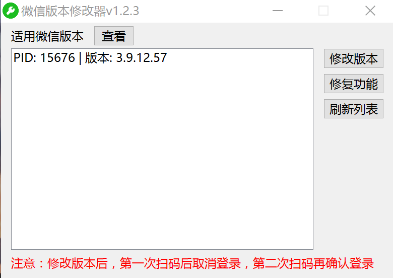

# 微信过低版本工具 

### 下载
[微信过低版本工具](https://github.com/sqcddzx/WechatVersionTool/releases/tag/WechatVersionTool)

### 界面

### 说明
1. 软件会被杀毒软件误判，请关闭杀毒软件或从隔离从还原软件  
2. 打开微信以及该工具  
3. 选择需要改版本的微信进程  
4. 点击修改版本，弹出修改成功即可  
5. 注意！！！ 修改版本后，第一次扫码后取消登录，
第二次扫码再确认登录  
（或者扫码2次都确认登录也可，第一次还是会提示版本低，第二次就能登上）  

### 支持
如果工具对您有帮助，请给个⭐或请我喝杯咖啡吧~  
